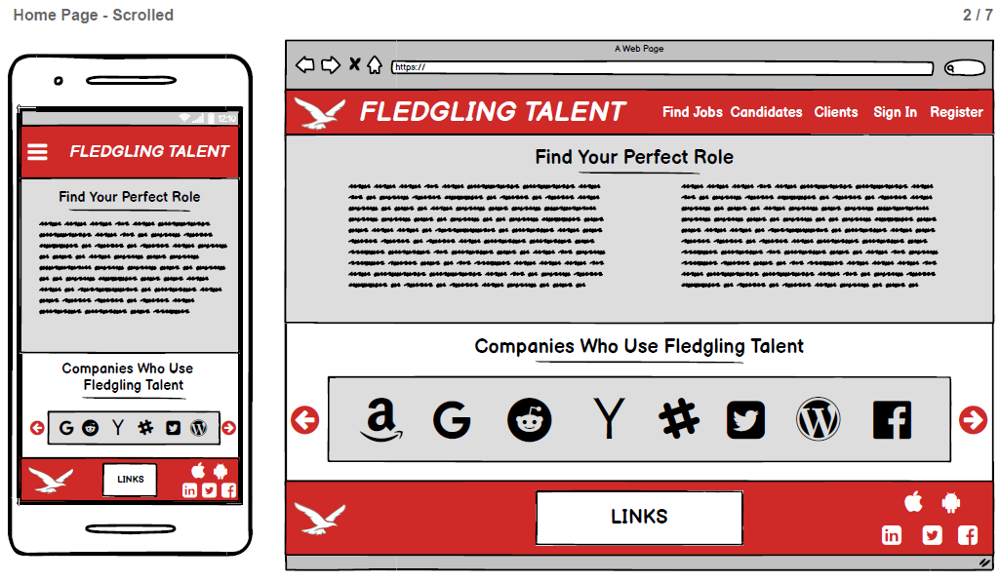
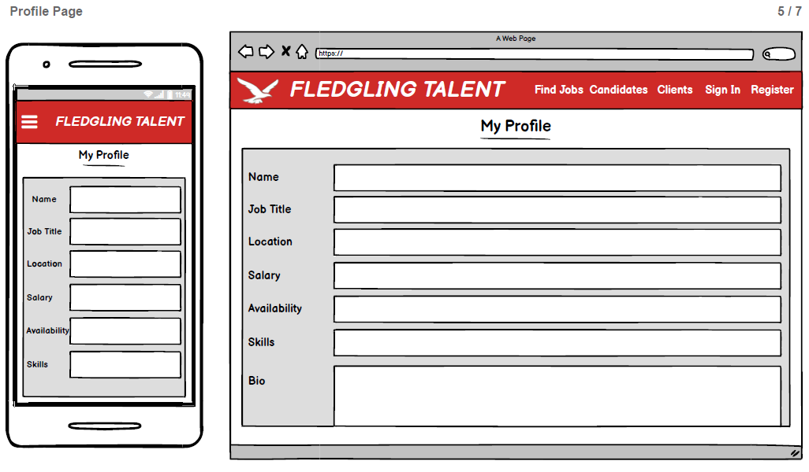

# [Fledgling Talent]()

[View the live project here](https://ci-ms3-fledgling-talent.herokuapp.com/)

The aim of my third project for the Code Institute was to create a community jobs board for entry level jobs within the tech industry using Python, Flask, MongoDB, JavaScript, CSS, Bootstrap and HTML.

The website will incorporate all CRUD (Create, Read, Update Delete) functions and be responsive across all devices from 320px up.

## Contents:

* [Description](#description)
* [User Stories](#user-stories)
* [Market Research](#market-research)
* [UX and Features](#ux-and-features)
* [Future Improvements](#future-improvements)
* [Changes](#changes)
* [Technologies Used](#technologies-used)
* [Testing](#testing)
* [Deployment](#deployment)
* [Credits](#credits)
* [Acknowledgements](#acknowledgements)
* [Support](#support)

## <a name="description">Description</a>

Fledgling Talent is a community jobs board where users are able to post entry level jobs within the tech sector for others to view.

It was designed for users to repost jobs that others may find interesting, rather than a place to apply for jobs directly.

## <a name="user-stories">User Stories</a>

* "I want to be able to create new jobs for others to view"
* "I want to be able to read other jobs that others have posted"
* " I want to be able to edit any jobs that I post in case any details have changed or were entered incorrectly in the first place"
* "I want to be able to delete any jobs that I have posted that are no longer available"
* "I want to be able to search for any jobs that may be suitable for me using different criteria such as job title or location"

## <a name="market-research">Market Research</a>

I decided to carry out some research into different types of jobs board that were on the market to find out what core elements needed to be included.

All this information was used when designing the layout, colour scheme, typography, images and features that were deployed to the final website and contributed to the above User Stories.

## <a name="ux-and-features">UX and Features</a>

The website was designed as a place where users seeking entry level roles within the tech industry could post jobs for others to view. The jobs they see on other websites may not be suitable for them, but they are then able to post them to Fledgling Talent to make others aware of the opportunity.

It would be a community based website, where users are trying to help each other find their first roles in tech.

#### 1. Strategy

The aim of the project was to create a simple community jobs board that included full CRUD functionality using Python, Flask, MongoDB, JavaScript, CSS, Bootstrap and HTML that could be built upon in the future to include more features.

##### Customer Goals

* Easy to register an account and sign in
* Easy to create a new jobs posting
* Easy to read other jobs posted
* Easy to update jobs that the user has posted
* Easy to delete any jobs that the user has posted
* Be able to search for jobs using a few different methods

#### 2. Scope

The scope of the project and features to include were influenced by the market research carried out. It should be a mobile-first website that is responsive on all devices from 320px upwards.

##### Current Features

* ###### Home Page

  * Large font used to make finding and distinguishing different pages and sections easy

  * Responsive navigation bar that condenses down to an icon on smaller devices

  * Large hero image of a city to draw the user in

  * Logo and h1 tag that is clickable across all pages to allow the user to easily navigate back to the home page

  * The two most recent jobs posted to the website will be shown on the home page for the user to view

  * An about section to explain to the user what the website is for and explain that it is a place to repost jobs and not apply direct

  * Footer with links to other website pages for easy navigation and also social links that open in a new tab

    

* ###### Find Jobs Page

  * Search bar appears at the top of the screen, with a helper message which explains users are able to search for jobs via job title or location

  * A reset button allows the users to reset and return to the jobs page where all jobs are shown

  * Easy to view jobs that displaying in order of most recent first

  * Easy to find more information button which expands the job information and shows the user the description, responsibilities, requirements, benefits and who posted it

  * Confirmation message appears on the screen to provide the user with feedback on any action they have taken

    

* ###### Post Job Page

  * Easy to understand form with a helper message which explains instructions for posting and formats to follow

  * Large post job button at the bottom of the page which is easy to see

  * Validation or selection is required for all aspects of the form

  * Confirmation message appears on the screen to provide the user with feedback on any action they have taken

    

* ###### Profile Page

  * Large hero image with someone pointing to their phone to clearly show what the page is for

  * Text which welcomes the user to their profile page and displays their username

  * Any jobs that they have posted will be shown here with the most recent being first

  * A user is able to see the full job they have posted by clicking the more information button - to improve UX and consistency, the job is viewed in the same way as other pages

  * Edit and delete buttons now show up for users of jobs they have posted

  * Delete modal pops up if a user wants to delete a job, asking for confirmation that they do actually wish to delete the job

  * Confirmation message appears on the screen to provide the user with feedback on any action they have taken

    

* ###### Edit Job Page

  * Once the edit button is clicked the user is taken back to the same form for when they posted the job and they are able to update any details they need to

  * Confirmation message appears on the screen to provide the user with feedback on any action they have taken

    

* ###### Sign In Page

  * Allows the user to sign in to their account

  * Link to registration page if the user does not already have an account

  * Confirmation message appears on the screen to provide the user with feedback on any action they have taken

    

* ###### Register Page

  * Allows the user to register an account
  * Helper message appears next to the username and password box to explain to the user acceptable formats for both
  * Link to the sign in page if the user already has an account
  * Confirmation message appears on the screen to provide the user with feedback on any action they have taken

#### 3. Structure

The site was designed to have essential pages which are Home, Find Jobs, Post Jobs, Profile and various Sign In/Register pages. 

The same navigation bar and footer was used across all pages for consistency and better IXD.

Short and easy to read paragraphs were used to easily get essential information across to users.

A selection of quality images were used to be engaging and draw users in. This was used in conjunction with showing a few of the most recent jobs on the home page in order to show users the types of jobs they are likely to find and get them interested in viewing them.

Some elements of the form require validation, but have no REGEX pattern requirement. Instead, a small helper message is posted next to this to assist the user with the proper formatting for posting/editing a job. This approach was chosen as limiting it using REGEX would make the form too difficult to complete, therefore causing a bad UX. As it is a community jobs board, the mentality would be that users are there to help others, so would conform to the requested format.

###### Data Schema

MongoDB was used to host the database and the following schema was designed:

* Under the role_type collection there are three strings all called role_type, however they all have different values which are Permanent, Temporary and Fixed Term Contract
* This collection was added at a later date, as I wanted to be able to get the previously selected value from a form to show up automatically when editing the job

#### 4. Skeleton

* Wireframe was created using [Balsamiq](https://balsamiq.com/)

  

###### Home Page

###### Home Page - Scrolled to bottom

###### Jobs Page

###### Add Job Page

###### Profile Page

###### Register Page

###### Sign In Page

#### 5. Surface

##### Design

* ###### Colour Scheme

  * The main colours used throughout the website were Maximum Red (#CF2A27), Gainsboro (#DDD), White (#FFF) and Black (#000). These were chosen as they felt professional and had good contrast to each other, thus making it easier to read long job descriptions

    

* ###### Typography

  * Open Sans was used as the main text across the entire website as it was clear to read and felt smooth which fits in well with the tech industry
  * Sans Serif was the back up font should the primary one not load

* ###### Imagery

  * All  hero images were sourced from [Unsplash](https://unsplash.com/)
  * Logo was sourced from [Logopond](https://logopond.com/farazshkh/showcase/detail/280031)
  * Error image was sourced from [Freepik](https://www.freepik.com/free-vector/funny-error-404-background-design_1161579.htm#page=1&query=404%20page&position=12#position=12&page=1&query=404%20page)

## <a name="future-improvements">Future Improvements</a>

* Ability to contact the employer directly, rather than the website just functioning as a jobs board to make users aware of opportunities that may interest them
* Add more information to user profiles which will enable employers to search for suitable candidates
* Ability to upload a CV and allow employers to browse for new candidates that suit their needs
* Ability to search by postcodes and show distances
* More searching and filter options
* Pagination for jobs pages when there are more posted

## <a name="changes">Changes</a>

* The original idea was to create a fully functional jobs board, however this idea was later changed to a community jobs board due to time and ability constraints at the time
* The website was originally going to feature multiple sectors, however as someone who was seeking their first role in the tech sector, it felt right to change to something that would be more relatable
* The search bar was moved to the top of the Find Jobs page, rather than over the home page image
* The profile page was simplified as the original design contained a lot of information which felt unnecessary at the time
* New collection called role_type was added to DB schema which features three strings (Permanent, Temporary and Fixed Term Contract)
  * This was done in order to get the previously selected value from a form to show when editing a job

## <a name="technologies-used">Technologies Used</a>

##### Languages Used

* [Python](https://en.wikipedia.org/wiki/Python_(programming_language))

* [JavaScript](https://en.wikipedia.org/wiki/JavaScript)

* [HTML5](https://en.wikipedia.org/wiki/HTML5)

* [CSS3](https://en.wikipedia.org/wiki/CSS)

  

##### Frameworks, Libraries, Programs and Websites Used

* [Bootstrap](https://getbootstrap.com/)

* [Hover.css](https://ianlunn.github.io/Hover/)

* [Google Fonts](https://fonts.google.com/)

* [Flask](https://en.wikipedia.org/wiki/Flask_(web_framework))

* [Heroku](https://en.wikipedia.org/wiki/Heroku)

* [Git](https://git-scm.com/)

* [GitHub](https://github.com/)

* [Balsamiq](https://balsamiq.com/)

* [Microsoft Paint](https://en.wikipedia.org/wiki/Microsoft_Paint)

* [Typora](https://typora.io/)

* [Techsini](http://techsini.com/multi-mockup/index.php)

* [Chrome DevTools](https://developers.google.com/web/tools/chrome-devtools)

* [TinyPNG](https://tinypng.com/)

* [Autoprefixer CSS](https://autoprefixer.github.io/)

* [Favicon.cc](https://www.favicon.cc/)

* [Photoscissors](https://photoscissors.com/)

* [Freepik](https://www.freepik.com/)

  

## <a name="testing">Testing</a>

##### User Story Testing

* "I want to be able to create new jobs for others to view"

  * A user can navigate to the Post Jobs page to post a new opportunity

    

* "I want to be able to read other jobs that others have posted"

  * A user can navigate to the Find Jobs page to view all jobs posted

    

* " I want to be able to edit any jobs that I post in case any details have changed or were entered incorrectly in the first place"

  * A user can navigate to their profile and edit any jobs they have posted

    

* "I want to be able to delete any jobs that I have posted that are no longer available"

  * A user can navigate to their profile and delete any jobs they have posted

    

* "I want to be able to search for any jobs that may be suitable for me using different criteria such as job title or location"

  * A user is able to navigate to the Find Jobs page and search for any jobs via their job title or location

    

##### General Testing

* All internal links on the page opened with success

* All external links opened in a new tab with success

* All pages/links that should be hidden if user not session were hidden and show fine for when in session

* Register - A new account was created called "Testuser2" with success

* Sign In - Used "Testuser2" to sign in with success

* Sign Out - Used "testuser2" to sign out with success

* Create - "Testuser2" was used to post a job with success

* Read - "Testuser2" was used to view all jobs posted to the website with success (The most recent job appearing at the top)

  * No jobs appeared on the profile page if the user had not posted any

* Update - "Testuser2" was able to update the role they had posted, with an increase in salary (£25,000 to £26,000)

  * The button to edit jobs not posted by Testuser2 did not appear

* Delete - "Testuser2" was able to delete the role they had posted, with the modal confirmation working fine

  * The button to delete jobs not posted by Testuser2 did not appear

* Search - Able to search for roles via job title and location with success

  * Reset button works and shows all jobs again

  

##### Validation

The W3C Markup Validator, W3C CSS Validator, JSHint and PEP8 Online services were used to validate every page of the project to ensure there were no syntax errors in the project.

[W3C Markup Validator](https://validator.w3.org/) 

[W3C CSS Validator](https://jigsaw.w3.org/css-validator/)

[JSHint](https://jshint.com/)

* No custom JavaScript was used in this project, so this test was not conducted

[PEP8 Online](http://pep8online.com/)

##### Devices

The website was initially tested on different types of devices using Chrome DevTools to see if there were any immediate issues. 

The website works well on all mobile devices from 320px and upwards.

[Google's Mobile-Friendly Test](https://search.google.com/test/mobile-friendly) was used and the results were that the 'Page is mobile friendly - this page is easy to use on a mobile device'.

The website was then sent via email to a number of family and friends of all ages to test on different devices to see how easy it was to use and how responsive it was.

The following devices were used:

* iPhone X - Chrome Browser
* iPad Air - Safari Browser
* iPad Mini - Safari Browser
* Samsung Galaxy S9 - Samsung Internet Browser
* iMac - OS X Yosemite - Safari Browser
* iPhone 11 Pro Max - Safari Browser
* Sony Vaio Laptop - Windows 8 - Chrome Browser

##### Errors/Bugs During Device Testing

* iPhone X - Chrome Browser
  * User was able to see Find Jobs and Post Jobs links in footer even when not signed in

* iPad Mini / iPad Air - Safari Browser
  * User was able to see Find Jobs and Post Jobs links in footer even when not signed in
  * Whitespace appearing below the footer on the Sign In, Register and Error pages

* Samsung Galaxy S9 - Samsung Internet Browser
  * User was able to see Find Jobs and Post Jobs links in footer even when not signed in

* iMac - OS X Yosemite - Safari Browser
  * User was able to see Find Jobs and Post Jobs links in footer even when not signed in
  * Whitespace appearing below the footer on the Sign In, Register and Error pages

* iPhone 11 Pro Max - Safari Browser
  * User was able to see Find Jobs and Post Jobs links in footer even when not signed in

* Sony Vaio Laptop - Windows 8 - Chrome Browser
  * User was able to see Find Jobs and Post Jobs links in footer even when not signed in

##### Errors During Testing

[W3C Markup Validator](https://validator.w3.org/) 

* Error - Attribute *pattern* not allowed on element <u>textarea</u> at this point
* Error - The first child *option* element of a *select* element with a required attribute, and without a *multiple* attribute, and without a *size* attribute whose value is greater than *1*, must have either an empty *value* attribute, or must have no text content - [Fixed](https://stackoverflow.com/questions/22237658/html5-validation-error-with-select-required-attribute/31800584)
* Warning - Section lacks heading
* Error - Aria-controls attribute must point to an element in the same document - [Fixed](https://webmasters.stackexchange.com/questions/60241/w3c-validation-error-aria-controls-attribute-must-point-to-an-element-in-the-sa)
* Error - The element button must not appear as a descendant of the a element - Fixed with help of Ed Bradley on Slack
* Error - h3 cannot appear as child of label

[W3C CSS Validator](https://jigsaw.w3.org/css-validator/)

* Error - Property *text-underline-offset* doesn't exist

##### Known Bugs

* Some elements of the form require validation, but have no REGEX pattern requirement. Instead, a small helper message is posted next to this to assist the user with the proper formatting for posting/editing a job. This approach was chosen as limiting it using REGEX would make the form too difficult to complete, therefore causing a bad UX. As it is a community jobs board, the mentality would be that users are there to help others, so would conform to the requested format.
  * Although this is not a bug, I felt I should address the reasoning behind choosing to have to REGEX pattern

## <a name="deployment">Deployment</a>

##### GitHub Pages

1. The project was deployed to GitHub Pages using the following steps:

2. A local project was created in GitHub with a new repository called 'CI-MS3-Fledgling Talent'

3. The project had regular push and detailed commits which were pushed to the GitHub website before deployment

4. The project was deployed by logging in to GitHub and locating the [GitHub Repository](https://github.com/scottsimpson91/CI-MS1-Hair-by-Jo)

5. At the top of the Repository (not top of page), locate the "Settings" Button on the menu and click

6. Scroll down the Settings page until the "GitHub Pages" Section was found

7. Under "Source", click the dropdown called "None" and select "Master Branch"

8. The page will automatically refresh

9. Scroll back down through the page to locate the now published site [link](https://scottsimpson91.github.io/CI-MS1-Hair-by-Jo/) in the "GitHub Pages" section

10. The code can be run locally through clone or download, you can do this by opening the [repository](https://github.com/scottsimpson91/CI-MS1-Hair-by-Jo), clicking on the code button and then selecting either 'clone' or 'download' 

11. Please choose the below instructions which apply to you:

    

##### Download

1. The Download option provides a link to download a ZIP file which can be unzipped on your local machine

   

##### Clone (Using command line)

1. The Clone option provides a url, which you can use on your desktop IDE - Follow the steps below - Additional guidance can be found [here](https://docs.github.com/en/free-pro-team@latest/github/creating-cloning-and-archiving-repositories/cloning-a-repository)

2. On GitHub, navigate to the main page of the repository

3. Above the list of files, click the green **Code** button with a download symbol

4. To clone the repository using HTTPS, under "Clone with HTTPS", click the clipboard icon. To clone the repository using an SSH key, including a certificate issued by your organization's SSH certificate authority, click **Use SSH**, then click the clipboard icon . To clone a repository using GitHub CLI, click **Use GitHub CLI**, then click the clipboard icon

5. Open Git Bash

6. Change the current working directory to the location where you want the cloned directory

7. Type `git clone`, and then paste the URL you copied earlier

8. Press **Enter** to create your local clone

9. If you are unsure on any of the above steps, then please see the guide which is provided in the first list item above

   

##### Clone (To GitHub Desktop)

1. The Clone option provides a url, which you can use on your desktop IDE - Follow the steps below - Additional guidance can be found [here](https://docs.github.com/en/free-pro-team@latest/github/creating-cloning-and-archiving-repositories/cloning-a-repository)
2. On GitHub, navigate to the main page of the repository
3. Above the list of files, click the green **Code** button with a download symbol
4. Click **Open with GitHub Desktop** to clone and open the repository with GitHub Desktop
5. Follow the prompts in GitHub Desktop to complete the clone
6. If you are unsure on any of the above steps, then please see the guide which is provided in the first list item above

##### Deployment to Heroku

###### Create Application

1. Navigate to Heroku.com and login
2. Click on the "New" button in the top right of the page and select "Create new app"
3. Enter the name of the app, select the region and click "Create app"

###### Connect to GitHub Repository

1. Click the deploy tab and select "GitHub - Connect to GitHub"
2. Under the section "Search for a repository to connect to" enter the repo-name in the designated box
3. Once the repo has been found, click the "Connect" button

###### Setting Environment Variables

1. Click on the settings tab and then click "Reveal Config Vars" and add the following:
2. key: IP, value: 0.0.0.0
3. key: PORT, value: 5000
4. key: MONGO_DBNAME. value: (Name of database you want to connect to)
5. key: MONGO_URI, value: (Enter MongoURI which can be found by going to Clusters > Connect > Connect to your application and inputting the password and DB name as required)
6. key: SECRET_KEY, value: (This is a unique secret key that was created by the developer)

###### Enable Automatic Deployment

1. Click on the Deploy tab
2. Under the "Automatic Deploy" section, select the branch from GitHub that you want to deploy the app from and then click Enable Automatic Deploys

## <a name="credits">Credits</a>

##### Media

* Favicon was generated from [Favicon.cc](https://www.favicon.cc/)
* [TinyPNG](https://tinypng.com/) was used to reduce the overall total image size
* Home hero image was sourced from [Unsplash](https://unsplash.com/photos/p_cHW1REBWc)
* Profile hero image was sourced from [Unsplash](https://unsplash.com/photos/4V8uMZx8FYA)
* Logo image was sourced from [Logopond](https://logopond.com/farazshkh/showcase/detail/280031)
* Error image was sourced from [Freepik](https://www.freepik.com/free-vector/funny-error-404-background-design_1161579.htm#page=1&query=404%20page&position=12#position=12&page=1&query=404%20page)

##### Code Snippets

* ###### [Codeply](https://www.codeply.com/)

  * Code for Navbar used and adapted to own project - [Here](https://www.codeply.com/go/qhaBrcWp3v)

* ###### [Stack Overflow](https://stackoverflow.com/)

  * Guidance on why a collapse animation may not be smooth - [Here](https://stackoverflow.com/questions/27221332/bootstrap-collapse-animation-not-smooth)
  * Guidance on how to format data in an array format - [Here](https://stackoverflow.com/questions/9073690/post-an-array-from-an-html-form-without-javascript)
  * Guidance on underline spacing - [Here](https://stackoverflow.com/questions/9586596/control-underline-position-on-text-decoration-underline)

* **[W3Schools](https://www.w3schools.com/)**

  * Guidance on how to use Python Datetime - [Here](https://www.w3schools.com/python/python_datetime.asp)

* ###### [Flask](https://flask.palletsprojects.com/en/1.1.x/)

  * Guidance on how to create error pages - [Here](https://flask.palletsprojects.com/en/1.1.x/patterns/errorpages/)

* ###### [Code Institute](https://codeinstitute.net/)

  * Guidance on how to make the CRUD and search functions was taken from the Task Manager walkthrough and adapted to own project

**Content**

* Job descriptions that were posted on the website have been sourced from various other jobs boards
* All other text content was written by the developer

## <a name="acknowledgements">Acknowledgements</a>

I would like to thank the following:

* My mentor, **Spencer Barriball**, for his guidance, wisdom and encouragement throughout the project

* **CI Staff** and **Slack Community** for their assistance with minor coding issues

* **Ed Bradley** and **Richard Wells** for their assistance with issues relating to my logo, button ids and search/reset buttons

  

## <a name="support">Support</a>

Thanks for taking the time to view my README. I hope you enjoyed your visit to my page.